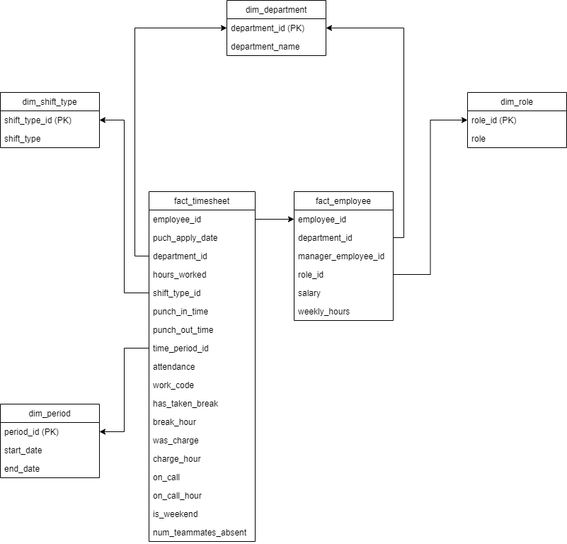

# Loading HR Data
In Day 4, I have transformed the timesheet data set. NOw, we have to load whole HR data according to model given below:



First of all, I imported psycopg2 required for connection with postgres database.
```
import psycopg2
```
Then, I defined a connection object to connect with the database.
```
def connect():
    return psycopg2.connect(
        host = "localhost", 
        database = "extraction_database", 
        user ="postgres", 
        password ="password", 
        port =5432
        )
```

Then,  I define a function to load timesheet data as I had already transformed it in Day4.
```
def load_timesheet_data(cur,con):
    with open('../sql/load_timesheet.sql') as file:
        sql = " ".join(file.readlines())
        cur.execute(sql)
        con.commit()
```
The function executes following queries:

At first, it deletes all the data from fact tables and dimension tables.
```
DELETE FROM fact_timesheet;
DELETE FROM dim_period;
DELETE FROM dim_shift_type;
```
Then, Inserts the value in dim_period and dim_shift_type tables.
```
INSERT INTO dim_period VALUES
(1,'2021-06-22','2021-07-06'),
(2,'2021-07-06','2021-07-20'),
(3,'2021-07-20','2021-07-31');

INSERT INTO dim_shift_type VALUES
(1,'Morning'),
(2,'Evening');
```
THen, it creates a temporary table to store transformed timesheet data in Day4 with some new attributes.
```
DROP TABLE IF EXISTS new_timesheet;
CREATE TABLE new_timesheet AS
SELECT 
employee_id,
department_id, shift_start_time, shift_end_time,
CAST(shift_date as DATE),
CASE 
WHEN
shift_type = 'Morning'
THEN 1
WHEN
shift_type = 'Evening'
THEN 2
ELSE 1
END As shift_type_id
,
CASE WHEN TO_CHAR(CAST(shift_date as DATE), 'Day') Like 'S%' 
THEN 'true'
ELSE false  END AS is_weekend,
CASE 
WHEN 
CAST(shift_date as DATE) BETWEEN '2021-06-22' AND '2021-07-06'
THEN 1
WHEN
CAST(shift_date as DATE) BETWEEN '2021-07-06' AND '2021-07-20'
THEN 2
WHEN
CAST(shift_date as DATE) BETWEEN '2021-07-20' AND '2021-07-31'
THEN 3
ELSE 1 
END AS time_period_id,
hours_worked,
attendance,has_taken_break, break_hour, was_charge,charge_hour,was_on_call, on_call_hour,num_teammates_absent
from transformation_timesheet;
```

Then, all data from dim_department is deleted and new data is inserted.
```
DELETE FROM dim_department;
INSERT INTO dim_department
SELECT DISTINCT department_id, department_name FROM raw_employee;
```
Finally, the fact_timesheet is also populated
```
INSERT into fact_timesheet(employee_id,department_id, shift_start_time, shift_end_time,shift_date,shift_type_id,is_weekend,time_period_id,hours_worked,attendance,has_taken_break,
	break_hour,was_charge,charge_hour,was_on_call,on_call_hour,num_teammates_absent) 
SELECT * FROM new_timesheet;
```
Then, I defined a function to extract employee data. As, we have already extracted employee data, this function will transform extracted data.
```
def extract_employee_data(cur,con):
    with open('../sql/extract_employee.sql') as file:
        sql = " ".join(file.readlines())
        cur.execute(sql)
        con.commit()
```
The function above will create a temporary data to store cleaned employee data.
```
DROP TABLE IF EXISTS employee;
CREATE TABLE employee AS
SELECT 
 employee_id AS client_employee_id,
 INITCAP(first_name) AS first_name,
 INITCAP(last_name) AS last_name,
 d.department_id AS department_id,
 (CASE WHEN manager_employee_id ='-' THEN NULL ELSE manager_employee_id END ) AS manager_employee_id,
 salary,
 CAST(hire_date AS DATE),
 CAST(CASE WHEN terminated_date='01-01-1700' THEN NULL ELSE terminated_date END AS date) AS terminated_date,
 terminated_reason,
 CAST(dob AS DATE) As dob,
 CAST(fte AS FLOAT) As fte,
 CAST(fte AS FLOAT) * 40 as weekly_hours,
 (CASE WHEN employee_role LIKE '%MGR%' or employee_role LIKE '%Supv%' THEN 'Manager' ELSE 'Employee' END) AS employee_role
 FROM raw_employee
 JOIN dim_department d ON raw_employee.department_id=d.department_id;
```

SImilarly, a temporary table for storing manager details.
```
DROP TABLE IF EXISTS manager;

CREATE TABLE manager AS
SELECT DISTINCT
 m.client_employee_id,
 m.first_name,
 m.last_name
FROM employee m
INNER JOIN employee e
ON e.manager_employee_id= m.client_employee_id;
```

Then, I created a function to load employee data.
```
def load_employee_data(cur,con):
    with open('../sql/load_employee.sql') as file:
        sql = " ".join(file.readlines())
        cur.execute(sql)
        con.commit()
```
The function does following tasks.
AT first it deletes the fact table and dim tabes:
```
DELETE FROM fact_employee;
DELETE FROM dim_role;
```

Then, it inserts data in dim_role
```
INSERT INTO dim_role(name)
SELECT DISTINCT employee_role FROM employee;
```
Again, it deletes and inserts data in dim_status table.
```
DELETE FROM dim_status;
INSERT INTO dim_status
VALUES
(1,'Active'),
(2,'Inactive');
```
Similarly, for dim_manager table.
```
DELETE FROM dim_manager;
INSERT INTO dim_manager
SELECT * FROM manager;
```
Finally, populating data in fact_employee
```
INSERT INTO fact_employee
SELECT 
   e.client_employee_id,
   e.first_name,
   e.last_name,
   e.department_id,
   e.manager_employee_id,
   CAST(e.salary as FLOAT),
   e.hire_date,
   e.terminated_date,
   e.terminated_reason,
   e.dob,
   e.fte,
   e.weekly_hours,
   r.id,
   CASE WHEN e.terminated_date IS NULL THEN 1 ELSE 2 END AS active_status_id
FROM employee e
INNER JOIN dim_role r ON r.name=e.employee_role;
```
Then, I defined a function main which on call executes all the function required to load data.
```
def main():
    con =connect()
    cur=con.cursor()
    load_timesheet_data(cur,con)
    extract_employee_data(cur,con)
    load_employee_data(cur,con)
    con.close()
    cur.close()
```

Finally, I called the main function to run.
```
if __name__ == "__main__":
    main()
```