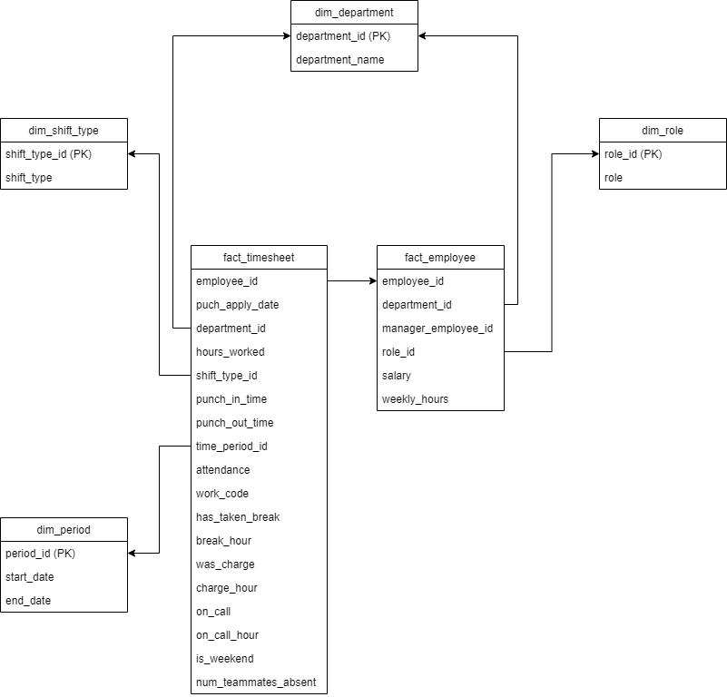

# ETL

# Logical Model for Data Warehouse

## Business Requirements
The business comes under health sector domain. The requirement of the business is given below:
* To be able to know if an employee was working on a particular day or not.
* If they worked, their star and left time, hours worked and if they were on charge should be known.
* If they didn’t work, were they on call should be known.
* There are two shifts in the company. Morning shift starts between 5:00 AM – 11:00 PM and evening starts after 12 PM. It should be known that which employee worked on which shift.
* To be able to know if the employees are working regularly on a weekend.
* To analyze the data on a biweekly basis starting from 2021-01-01.
* To analyze if any employee has to cover for other team members regularly.
* To analyze the data based on the employee role.
* To analyze the salary distribution by department.

There are two datasets provided for which we have to prepare a logical model which are employee and timesheet. The employee sheet contains data like employee name, their department, manager, salary, birth date etc. whereas timesheet dataset contains work day details like punch apply date, punch in time, punch out time etc.

According to the detail study on dataset and requirements provided by the client, the fact table and dimension table identified are as follows:

1. Fact Table
* fact_timesheet – This table contains the data related to employee timesheet 
*	fact_employee – This table contains data related to employee details like their department.
2.	Dimension Table
*	shift – Dimension table of fact_timesheet
*	department – Dimension table for both fact_timesheet and fact_employee
*	role – Dimension table for fact_employee
*	time period – Dimension table for fact_timesheet

