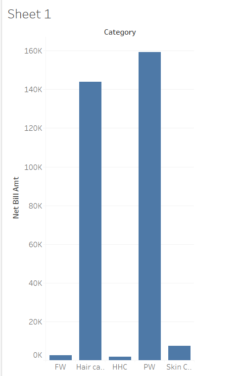
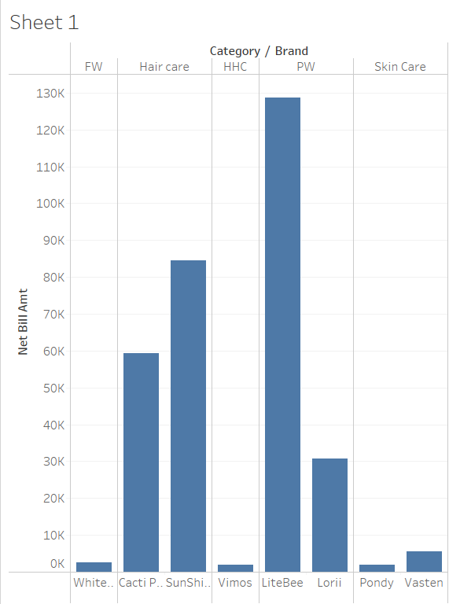

# Ecommerce Data Warehouse
## Logical Model
### Business Requirements
The business comes under ecommerce domain. The business requirements are as follows:

* To know products that are selling fast and producing high profits
* To find the products that are not doing so good
* To know the highest selling products according to category
* To knw the highst selling products according to brand
* To know the sales details date wise i.e. yearly, monthly and specific day of week basis.
* To know the sales in a particular location

From the dataset provided which are customer_dump, sales_dump and order_dump, the following fact table and dimension table can be identified:
1. Fact Table
* fact_sales- This fact table contains data related to sales.
2. Dimension Table
* dim_product - This dimension table consists of product details
* dim_category - This dimension table consists of category a product belongs to
* dim_date - This dimension consists of details of sales date
* dim_customer - This dimension consists of customer details
* dim_town - This dimension consists of town the customer belongs to
* dim_employee - This dimension consists of employee who are involved in sales


From above logical model, business requirements of the client can be met. The date dimension stores the details of sales accrding to month, day and year basis. SImilarly, category dimension helps in finding out sales according to category.

# Physical Model

The logical model was then converted into physical model after choosing appropriate data types and keys.


## Folder Structure

* data - This folder contains data needed to be extracted.
* docs - documentation files
* schema - create table scripts
* src/pipeline - python codes
* src/sql - sql scripts

## Database connection
I made a file name `connection.py` which uses psycopg2 library to connect with the postgres database.
```
import psycopg2

def connect():
    return psycopg2.connect( 
        host = "localhost", 
        database = "ecommerce_warehouse", 
        user ="postgres", 
        password ="password", 
        port =5432
        )

```
## Extraction
First of all, we need to extract the data from the csv file. I imported the connection file to connect with the database.
```
from connection import connect
```
Then , I defined a function to extract customer data.
```
def extract_customer_data(cur,con,filePath):
```
Let me explain you the function.
First of all, it deletes all the records from the table where data is to be extracted.
```
delete_sql = """DELETE FROM raw_customer"""
    cur.execute(delete_sql)
    con.commit()
```
Then, it opens the file and uses a  for loop to insert each row of data from csv file.
```
with open(filePath, 'r') as file:
        i = 0
        for line in file:
            if i == 0:
                i += 1
                continue
            row = line.split(",")
            sql = """INSERT INTO raw_customer(customer_id,user_name,first_name,last_name,country,town,active)
            VALUES( %s,%s, %s, %s, %s, %s, %s)"""
            cur.execute(sql, row)
            con.commit()
            i += 1
```
Now, this code checks if the data is already in the archive or not.
```
search_sheet = "select customer_id from raw_customer_archive where sheet_name = '" + filePath + "'"
    cur.execute(search_sheet)
```
if the record is present in the archive table:
```
if(cur.fetchall()):
        print("archive already exists for customers!!!")
```
If it is not then, it stores the data in archive.
```
else:
        with open(filePath, 'r') as file:
            i = 0
            for line in file:
                if i == 0:
                    i += 1
                    continue
                row1 = line.split(",")
                row1.append(filePath)
                sql1 = """INSERT INTO raw_customer_archive(customer_id,user_name,first_name,last_name,country,town,active,sheet_name)

                VALUES( %s,%s, %s, %s, %s, %s, %s,%s)"""
                cur.execute(sql1, row1)
                con.commit()
                i += 1
        print("New archive created for customer data!!!!")
```

Likewise, same approach is implemented for sales and product data.

For products data:
```
def extract_products_data(cur,con,filePath):
    delete_sql = """DELETE FROM raw_products"""
    cur.execute(delete_sql)
    con.commit()
    with open(filePath, 'r') as file:
        i = 0
        for line in file:
            if i == 0:
                i += 1
                continue
            row = line.split(",")
            sql = """INSERT INTO raw_products(product_id,product_name,description,price,mrp,pieces_per_case,weight_per_piece,uom,brand,category,tax_percent,active,created_by,created_date,updated_by,updated_date)
            VALUES( %s,%s, %s, %s, %s, %s, %s,%s,%s, %s, %s, %s, %s, %s,%s,%s)"""
            cur.execute(sql, row)
            con.commit()
            i += 1

    search_sheet = "select product_id from raw_products_archive where sheet_name = '" + filePath + "'"
    cur.execute(search_sheet)
    if(cur.fetchall()):
        print("archive already exists for products!!!")
    else:
        with open(filePath, 'r') as file:
            i = 0
            for line in file:
                if i == 0:
                    i += 1
                    continue
                row1 = line.split(",")
                row1.append(filePath)
                sql1 = """INSERT INTO raw_products_archive(product_id,product_name,description,price,mrp,pieces_per_case,weight_per_piece,uom,brand,category,tax_percent,active,created_by,created_date,updated_by,updated_date,sheet_name)

                VALUES( %s,%s, %s, %s, %s, %s, %s,%s,%s, %s, %s, %s, %s, %s,%s,%s, %s)"""
                cur.execute(sql1, row1)
                con.commit()
                i += 1
        print("New archive created for product data!!!!")

```

For sales data
```
from connection import connect


def extract_sales_data(cur,con,filePath):
    con = connect()
    cur = con.cursor()
    delete_sql = """DELETE FROM raw_sales"""
    cur.execute(delete_sql)
    con.commit()
    with open(filePath, 'r') as file:
        i = 0
        for line in file:
            if i == 0:
                i += 1
                continue
            row = line.split(",")
            sql = """INSERT INTO raw_sales(id,transaction_id,bill_no,bill_date,bill_location,customer_id,product_id,qty,uom,price,gross_price,tax_pc,tax_amt,discount_pc,discount_amt,net_bill_amt,created_by,updated_by,created_date,updated_date)
            VALUES( %s,%s, %s, %s, %s, %s, %s,%s,%s, %s, %s, %s, %s, %s,%s,%s, %s, %s, %s, %s)"""
            cur.execute(sql, row)
            con.commit()
            i += 1

    search_sheet = "select id from raw_sales_archive where sheet_name = '" + filePath + "'"
    cur.execute(search_sheet)
    if(cur.fetchall()):
        print("archive already exists for sales!!!")
    else:
        with open(filePath, 'r') as file:
            i = 0
            for line in file:
                if i == 0:
                    i += 1
                    continue
                row1 = line.split(",")
                row1.append(filePath)
                sql1 = """INSERT INTO raw_sales_archive(id,transaction_id,bill_no,bill_date,bill_location,customer_id,product_id,qty,uom,price,gross_price,tax_pc,tax_amt,discount_pc,discount_amt,net_bill_amt,created_by,updated_by,created_date,updated_date,sheet_name)
                VALUES( %s,%s, %s, %s, %s, %s, %s,%s,%s, %s, %s, %s, %s, %s,%s,%s, %s, %s, %s, %s,%s)"""
                cur.execute(sql1, row1)
                con.commit()
                i += 1
        print("New archive created for sales data!!!!")

```

## Transformation
For transformation, I have defined specific functions which executes sql commands. 
1. Customer

For customer, I have defined a function transform_customer_data.
```
def transform_customer_data(cur,con):
    with open('../sql/update_customer.sql') as file:
        sql = " ".join(file.readlines())
        cur.execute(sql)
        con.commit()

```
The above function does following tasks:
First of all, it updates the active status as y to true and else to false to store boolean values.
```
UPDATE raw_customer_archive 
SET active='true'
WHERE active='Y';
```
Then, it deletes the data from town and enters the data for town.
```
TRUNCATE TABLE town RESTART IDENTITY;
INSERT INTO town(town_name)
SELECT DISTINCT town FROM raw_customer_archive;
```
Similarly, it deletes data from customer table and stores new data.

```
DELETE FROM customers;

INSERT INTO customers
SELECT 
  CAST(c.customer_id AS INT),
  c.user_name,
  CAST(INITCAP(c.first_name) AS VARCHAR) AS first_name,
  CAST(INITCAP(c.last_name) AS VARCHAR) AS last_name,
  CAST(INITCAP(c.country) AS VARCHAR) AS country,
  t.town_id,
  CAST(c.active AS bool)
FROM raw_customer_archive c
INNER JOIN town t on t.town_name=c.town;
```
2. Products

Function defination to transform product data
```
def transform_product_data(cur,con):
    with open('../sql/update_product.sql') as file:
        sql = " ".join(file.readlines())
        cur.execute(sql)
        con.commit()

```
The function does following tasks:
FIrst of all, it updates active as Y to true and as N to false to store in boolean value.
```
UPDATE raw_products_archive 
SET active='true'
where active='Y';

UPDATE raw_products_archive 
SET active='false'
where active='N';
```
Then, it deletes data from category table and inserts new data to it.
```
TRUNCATE TABLE category RESTART IDENTITY;
INSERT INTO category(category)
SELECT DISTINCT category from raw_products_archive;
```
Similarly, it deletes data from product table and inserts new data into it.
```
DELETE FROM products;
INSERT INTO products
select
CAST(p.product_id AS INT),
p.product_name,
p.description,
CAST(p.price AS FLOAT),
CAST(p.mrp AS FLOAT),
CAST(p.pieces_per_case AS NUMERIC),
CAST(p.weight_per_piece AS NUMERIC),
p.uom,
p.brand,
c.category_id,
CAST(p.tax_percent AS FLOAT),
CAST(p.active AS BOOL),
p.created_by,
CAST(p.created_date AS TIMESTAMP),
p.updated_by,
CAST(p.updated_date AS TIMESTAMP)
FROM raw_products_archive p
INNER JOIN category c on c.category = p.category;
```

3. Sales
Defining function to transform sales data
```
def transform_sales_data(cur,con):
    with open('../sql/update_sales.sql') as file:
        sql = " ".join(file.readlines())
        cur.execute(sql)
        con.commit()
```
First of all, as february consists of only 28 days it converts '2017-02-30' to '2017-02-28'
```
UPDATE raw_sales_archive
SET bill_date='2017-02-28 11:00:00'
WHERE bill_date='2017-02-30 11:00:00';
```
Then, it empty date table and inserts new data into it.
```
TRUNCATE TABLE date RESTART IDENTITY;;
INSERT INTO date(bill_date,date,year,time,month,day)
SELECT DISTINCT bill_date, 
CAST(bill_date as DATE) as date,
EXTRACT(YEAR FROM CAST(bill_date as date)) as year,
CAST(bill_date as TIMESTAMP)::TIMESTAMP::TIME as time,
TO_CHAR(CAST(bill_date as DATE), 'Month') as month,
TO_CHAR(CAST(bill_date as DATE), 'Day') as day
FROM raw_sales_archive;
```

Similarly, it deletes all employee data and inserts new data into it.
```
TRUNCATE TABLE employee RESTART IDENTITY;
INSERT INTO employee(employee_name)
SELECT DISTINCT INITCAP(created_by) FROM  raw_sales_archive;
```
Likewise, it creates temporary table to store transformed sales data.
```
DROP TABLE IF EXISTS sales;
CREATE TABLE sales AS
SELECT s.id, 
CAST(s.transaction_id AS INT), 
CAST(s.bill_no AS INT), 
d.id AS date_id,
CAST(s.customer_id AS INT),
CAST(s.product_id AS INT), 
CAST(s.qty AS NUMERIC ), 
CAST(s.gross_price AS FLOAT) ,
CAST(s.tax_pc AS FLOAT),
CAST(s.tax_amt AS FLOAT),
CAST(s.discount_pc AS FLOAT),
CAST (s.discount_amt AS FLOAT),
CAST(s.net_bill_amt AS FLOAT),
e.employee_id
FROM raw_sales_archive s
INNER JOIN date d ON d.bill_date=s.bill_date
INNER JOIN employee e ON e.employee_name= INITCAP(s.created_by);
```
## Loading
1. Customer

Function defination to load customer data
```
def load_customer_data(cur,con):
    with open('../sql/load_customer.sql') as file:
        sql = " ".join(file.readlines())
        cur.execute(sql)
        con.commit()
```
As, we have already transfromed the data in transformation phase, this function will only store data to respective dimension tables.
```
DELETE FROM fact_sale;
DELETE FROM dim_customer;

DELETE FROM dim_town;

INSERT INTO dim_town
SELECT * FROM town;

INSERT INTO dim_customer 
SELECT *  FROM customers;
```

2. Product

Function defination to load product data
```
def load_product_data(cur,con):
    with open('../sql/load_product.sql') as file:
        sql = " ".join(file.readlines())
        cur.execute(sql)
        con.commit()
```
This function also loads data to respective dimension tables.
```
DELETE FROM dim_product;
DELETE FROM dim_category;

INSERT INTO dim_category
SELECT * FROM category;

INSERT INTO dim_product
SELECT * FROM products;
```

3. Sales

Function defination to load sales data
```
def load_sale_data(cur,con):
    with open('../sql/load_sale.sql') as file:
        sql = " ".join(file.readlines())
        cur.execute(sql)
        con.commit()

```
This function also loads data into respective dimension and fact tables.
```
DELETE FROM dim_date;

INSERT INTO dim_date
SELECT id, date, year, time, month, day
FROM date;

DELETE FROM dim_employee;

INSERT INTO dim_employee
select * from employee;

INSERT INTO fact_sale
select * from sales;
```
Finally, main.py executes all the function which extracts, transforms and loads the data to the warehouse.
```
from connection import connect
from extract_data import *
from transform_data import *
from load_data import *

def extract_raw_data():
    extract_sales_data(cur,con,'../../data/sales_dump.csv')
    extract_products_data(cur,con,'../../data/product_dump.csv')
    extract_customer_data(cur,con,'../../data/customer_dump.csv')
    

def transform_raw_data():
    transform_customer_data(cur,con)
    transform_product_data(cur,con)
    transform_sales_data(cur,con)

def load_transform_data():
    load_customer_data(cur,con)
    load_product_data(cur,con)
    load_sale_data(cur,con)

if __name__ == "__main__":
    con = connect()
    cur = con.cursor()
    extract_raw_data()
    transform_raw_data()
    load_transform_data()
    cur.close()
    con.close()
```

# DATA VISUALIZATION
## TABLEAU
Tableau is a powerful and fastest growing data visualization tool used in the Business Intelligence Industry.

Connecting to postgres database using Tableau


Mapping fact and dimension tables in Tableau


Visualizing data on the basis of sales and category



Visualizing data on the basis of sales and category and brand




